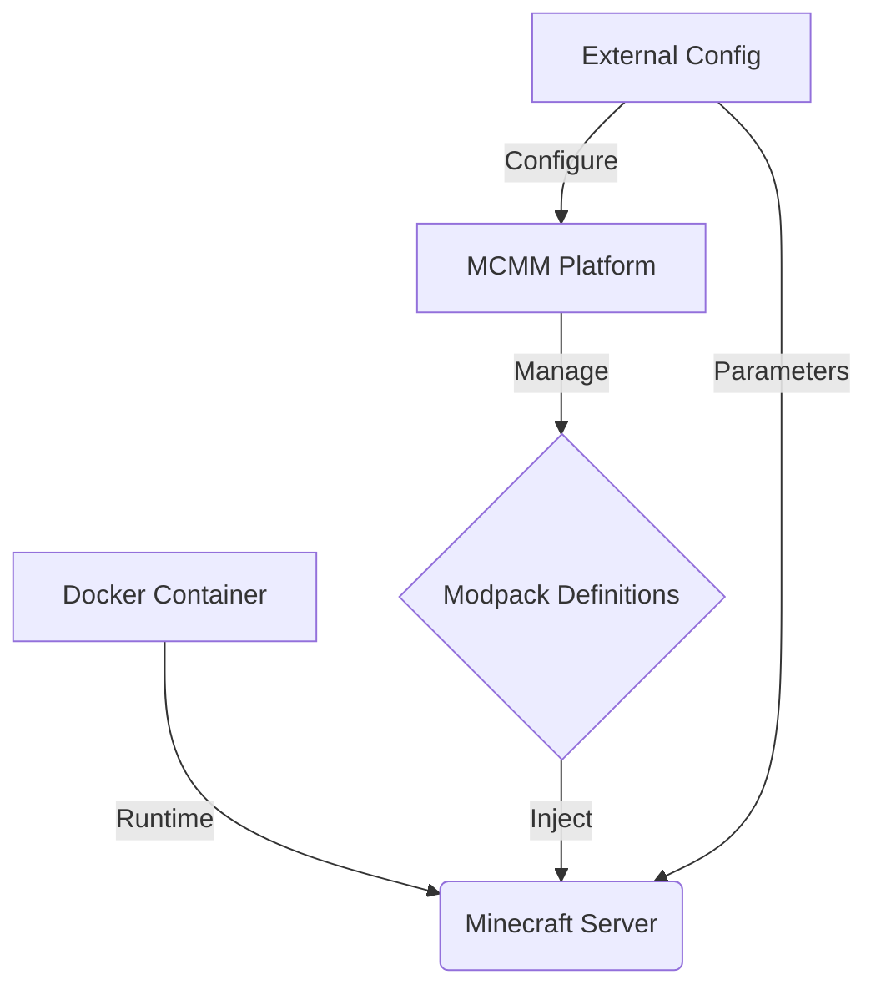
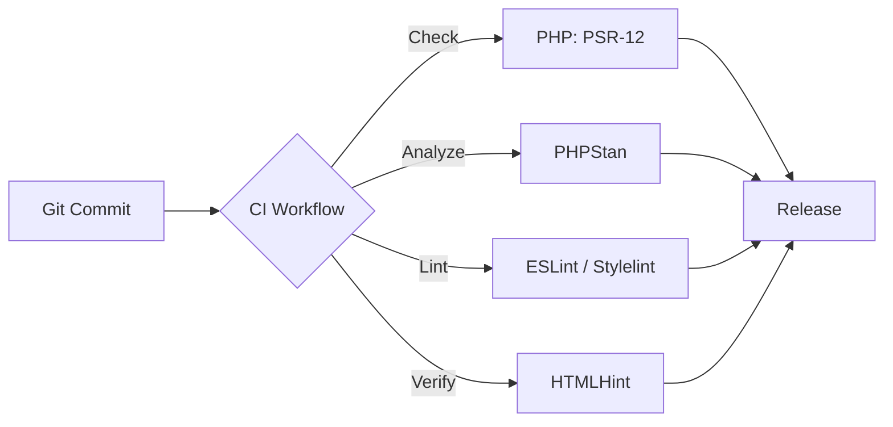

# Modpack Manager (MCMM)


## Overview

MCMM is designed to act as a foundational platform for managing Minecraft modpacks in
containerized or server-oriented environments. The project emphasizes maintainability,
modularity, and the enforcement of consistent coding standards across all components.

Minecraft server instances managed by MCMM are created and operated using Docker images
provided by [itzg](https://github.com/itzg/docker-minecraft-server). These images are widely
adopted, actively maintained, and serve as the standardized runtime layer for all Minecraft
servers provisioned through MCMM.

This README intentionally provides a high-level overview only. Detailed usage,
configuration, and deployment documentation may be added as the project matures.

---

## Latest Release

<!-- START_RELEASE -->
# 🚀 v0.0.3 Release Notes

We're thrilled to announce the release of **v0.0.3**! This update focuses on establishing foundational elements crucial for the project's ongoing development.

### 🚀 New Features

*   **Initial Content & Foundations:** A core set of files and foundational content has been added to the project, laying the groundwork for upcoming features and functionality.
<!-- END_RELEASE -->

---

## Architecture

MCMM follows a modular and extensible architecture, designed to clearly separate concerns
and support future growth.



### Container Runtime Layer

Minecraft servers run inside Docker containers based on itzg-provided images. This ensures
a consistent, reproducible, and well-supported execution environment for both vanilla and
modded servers.

### Modpack Management Layer

MCMM is responsible for organizing, validating, and preparing modpack definitions that are
injected into the containerized server runtime.

### Configuration and Orchestration Layer

Server configuration, lifecycle control, and environment-specific parameters are managed
externally to the container images. This allows a clean separation between infrastructure
concerns and application logic.

This layered approach allows MCMM to remain agnostic of specific hosting environments while
still leveraging best-in-class container images for Minecraft server execution.

---

## Project Structure

<!-- START_TREE -->
```
.
├── .github/ (scripts, workflows, linters)
├── images/
├── include/
├── javascript/
├── plugin/
├── styles/
├── empty_report.json
├── default.cfg
├── mcmm.page
├── README.md
├── api.php
├── mcmm-plugin.zip
├── package.json
├── release_notes.md
├── SECURITY.md
```
<!-- END_TREE -->

---

## Code Quality and Tooling

The repository enforces strict coding standards through automated tooling to ensure
long-term maintainability and reliability:



- **PHP**: PSR-12 compliance enforced via PHP CodeSniffer
- **Static Analysis**: PHPStan
- **JavaScript**: ESLint
- **CSS**: Stylelint
- **HTML**: HTMLHint

All contributions are expected to pass these checks.

---

## Contributions

Contributions are welcome. Please ensure that all changes adhere to the established coding
standards and that all automated checks pass before submitting a pull request.

Architectural changes should remain aligned with the project’s modular and container-first
design philosophy.

---

## License

This project is licensed under the MIT License.  
See the `LICENSE` file in the repository root for full details.

---

## Contact

Use GitHub Issues for bug reports, feature requests, or general discussion.
